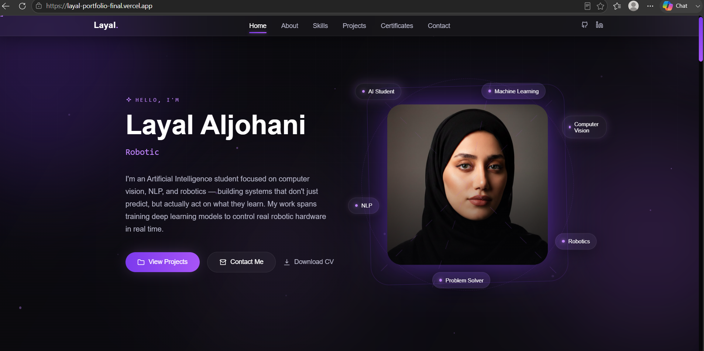

# 🚀 AI Portfolio Website

A modern personal portfolio website showcasing my projects, skills, certifications, and experience as an Artificial Intelligence student.

## 🌐 Live Demo

🔗https://layal-portfolio-final.vercel.app/

---

## ✨ About

This portfolio was created using an AI-assisted workflow through **Vibe Coding**.

The website was iteratively improved using prompt engineering, then deployed on **Vercel** to make it publicly accessible.

---

## 🎯 Features

- ✨ Modern and responsive design
- 🤖 AI-focused portfolio
- 💼 Projects showcase
- 🏆 Certifications section
- 📄 Downloadable CV
- 📬 Contact section

---

## 🛠️ Technologies

- HTML5
- CSS3
- JavaScript
- Claude AI
- Vercel

---

## 📸 Preview

---

## 🚀 Deployment

This project is deployed on **Vercel**.
